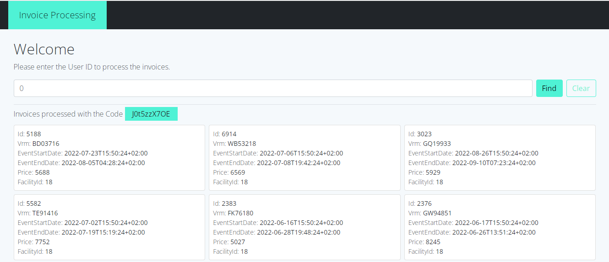

# Invoice Processing
[](https://hub.docker.com/r/loqo71la/invoice-processing)
[](https://github.com/loqo71la/invoice-processing/actions/workflows/coverage.yml)
[](https://codecov.io/gh/loqo71la/invoice-processing)

It is an demo library that will allow you to obtain pending invoices to be evaluated and processed on a required server.

# For Production
## Prerequisites
- [Docker](https://docs.docker.com/get-docker)
## How to use
The following steps will run a local instance of invoice processing.
1. Clone this repository.
```
git clone https://github.com/loqo71la/invoice-processing.git
```
2. Navigate into the root project.
```
cd invoice-processing
```
3. Run the `docker compose` command.
```
docker compose up -d
```
Finally point your browser to [http://localhost:7154](http://localhost:7154).

# For Developers
## Prerequisites
- [Net Core 6+](https://dotnet.microsoft.com/download)


## Web Client
Move to **/InvoiceProcessing.Web** directory:
```
cd InvoiceProcessing.Web
```
Restore dependencies:
```
dotnet restore
```
Add the following variables to your file **appsettings.json**
```
"FetchUrl": "https://** Your site **",
"SendUrl": "https://** Your site **"
```
To run the Web client
```
dotnet run
```
At this time, you have a service running at https://localhost:7154/



## Running Test
Move to **/InvoiceProcessing.Test** directory:
```
cd InvoiceProcessing.Test
```
To run the tests
```
dotnet test
```

## Add it as custom Package
To add the core module to your custom products, move **/InvoiceProcessing.Core** to your preferred directory and run the following command:
```
dotnet sln "Your solution.sln" add "New InvoiceProcessing.Core Directory\InvoiceProcessing.Core.csproj"
```
Add the following variables to your file **appsettings.json**
```
{
    "FetchUrl": "https://** Your site **",
    "SendUrl": "https://** Your site **"
}
```
